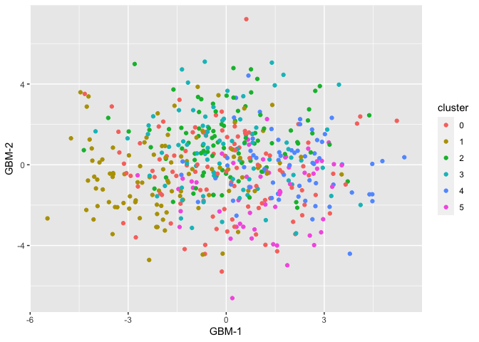
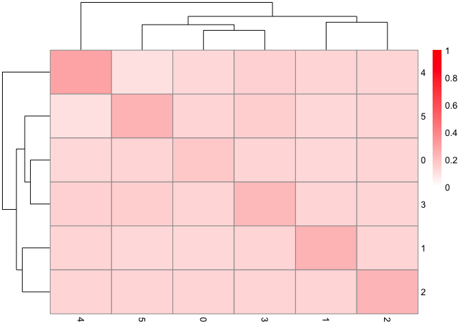
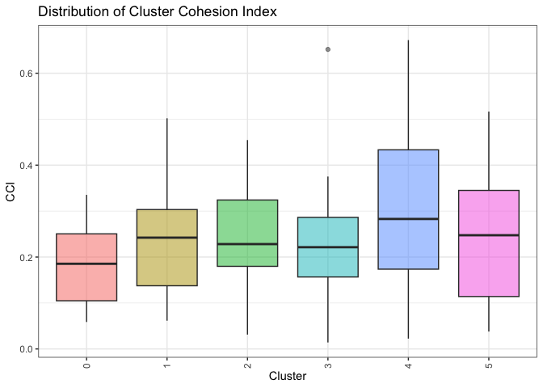

Model-based Dimensionality Reduction for Single-cell RNA-seq with
Generalized Bilinear Models
================
R package version 1.1.1

## Installation

From the R console, `devtools::install_github("phillipnicol/scGBM")`.

## Demo

We demonstrate scGBM by applying it to a random noise (i.e., a dataset
with no latent variaiblity).

``` r
library(scGBM)
set.seed(1126490984)
```

We begin by generating the count matrix such that each entry is
(independently) Poisson with rate 1:

``` r
I <- 500
J <- 500
Y <- matrix(rpois(I*J,lambda=1),nrow=I,ncol=J)
colnames(Y) <- 1:J; rownames(Y) <- 1:I
```

Run scGBM with $M = 10$ latent factors

``` r
out <- gbm.sc(Y,M=10)
```

    ## Iteration:  1 . Objective= -240304.2 
    ## Iteration:  2 . Objective= -240294.5 
    ## Iteration:  3 . Objective= -240287 
    ## Iteration:  4 . Objective= -240281.6 
    ## Iteration:  5 . Objective= -240277.9 
    ## Iteration:  6 . Objective= -240275.1 
    ## Iteration:  7 . Objective= -240273 
    ## Iteration:  8 . Objective= -240271.2 
    ## Iteration:  9 . Objective= -240269.9 
    ## Iteration:  10 . Objective= -240269.1 
    ## Iteration:  11 . Objective= -240268.9 
    ## Iteration:  13 . Objective= -240268.9 
    ## Iteration:  14 . Objective= -240268.6 
    ## Iteration:  15 . Objective= -240268 
    ## Iteration:  16 . Objective= -240267.4 
    ## Iteration:  17 . Objective= -240267 
    ## Iteration:  18 . Objective= -240266.9 
    ## Iteration:  20 . Objective= -240266.9 
    ## Iteration:  21 . Objective= -240266.8 
    ## Iteration:  22 . Objective= -240266.7 
    ## Iteration:  23 . Objective= -240266.5 
    ## Iteration:  24 . Objective= -240266.4 
    ## Iteration:  25 . Objective= -240266.4 
    ## Iteration:  26 . Objective= -240266.3 
    ## Iteration:  27 . Objective= -240266.2 
    ## Iteration:  28 . Objective= -240266 
    ## Iteration:  29 . Objective= -240265.9

    ## For users of newer versions (1.0.1+): the `scores` matrix now contains factor scores, the `V` matrix is UNSCALED scores.

To use the projection method (faster version based on subsampling), use

``` r
##Specify subsample size and number of cores
out.proj <- gbm.sc(Y,M=10,subset=100,ncores=8) 
```

Cluster the cell scores using Seurat

``` r
library(Seurat)
Sco <- CreateSeuratObject(counts=Y)
colnames(out$scores) <- 1:10
Sco[["gbm"]] <- CreateDimReducObject(embeddings=out$scores,key="GBM_")
Sco <- FindNeighbors(Sco,reduction = "gbm")
Sco <- FindClusters(Sco)
```

Plot the scores and color by the assigned clustering:

``` r
plot_gbm(out, cluster=Sco$seurat_clusters)
```

<!-- -->

Quantify the uncertainty in the low dimensional embedding:

``` r
out <- get.se(out)

## Standard errors of scores and loadings are now in the list
head(out$se_scores) 
```

    ##              1         2         3         4         5         6         7
    ## [1,] 0.9827696 0.9604884 0.9833750 0.9986217 0.9961750 0.9939438 1.0024827
    ## [2,] 0.9868728 0.9573743 0.9942293 1.0230468 1.0038184 0.9887006 0.9953444
    ## [3,] 0.9692269 0.9614666 0.9672354 0.9273413 0.9547951 0.9570453 0.9664860
    ## [4,] 0.9676738 0.9670946 0.9542210 0.9424605 0.9483404 0.9524144 0.9460106
    ## [5,] 1.0063214 1.0163037 0.9823466 0.9929520 0.9971580 1.0056245 1.0034012
    ## [6,] 1.0528522 1.0371955 1.0451813 1.0685987 1.0542485 1.0463961 1.0422791
    ##              8         9        10
    ## [1,] 0.9955121 1.0007955 0.9854292
    ## [2,] 0.9969187 0.9981072 0.9745440
    ## [3,] 0.9675816 0.9671162 0.9636636
    ## [4,] 0.9595275 0.9457462 0.9502666
    ## [5,] 1.0019558 1.0120540 0.9979084
    ## [6,] 1.0487410 1.0483612 1.0355369

You can visualize the uncertainty with ellipses around the points

``` r
plot_gbm(out, cluster=Sco$seurat_clusters, se=TRUE)
```

<!-- -->

Now we evaluate cluster stability using the cluster cohesion index.
First we need to define a function that takes as input a set of
simulated scores $\tilde{V}$ and returns a new clustering:

``` r
cluster_fn <- function(V,Y) {
  Sco <- CreateSeuratObject(Y)
  colnames(V) <- 1:ncol(V)
  Sco[["gbm"]] <- CreateDimReducObject(embeddings=V,key="GBM_")
  Sco <- FindNeighbors(Sco,reduction = "gbm")
  Sco <- FindClusters(Sco)
  as.vector(Sco$seurat_clusters)
}
```

Now we can run the CCI function. Here we set `reps=10` to make it fast
but `reps=100` (or higher) is recommended on real analyses.

``` r
cci <- CCI(out,cluster.orig=Sco$seurat_clusters, reps=25, cluster.fn = cluster_fn, Y=Y)
```

``` r
pheatmap::pheatmap(cci$H.table,legend=TRUE, color=colorRampPalette(c("white","red"))(100),
        breaks=seq(0,1,by=0.01),
        rownames=TRUE,
        colnames=TRUE)
```

<!-- -->

``` r
#Just the diagonal
cci$cci_diagonal
```

<!-- -->

The heatmap shows there is significant overlap between the clusters.
This makes sense because the data was simulated to have no latent
variability.

## Reference

If you use `scGBM` in your work, please cite:

Nicol, P.B. and Miller, J.W. (2023). Model-based dimensionality
reduction for single-cell RNA-seq using generalized bilinear models.
bioRxiv.
