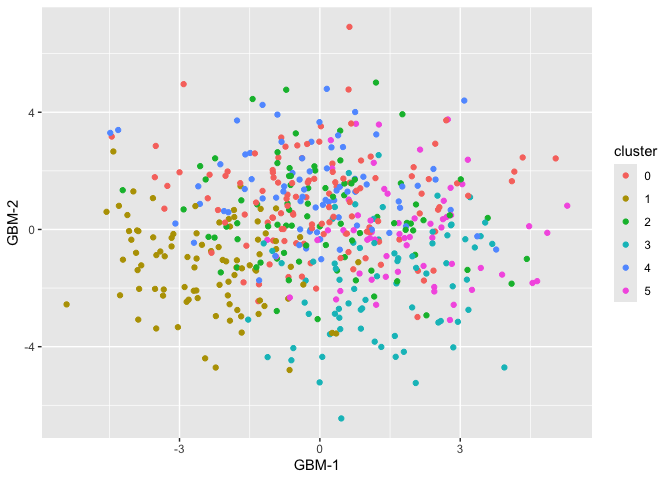
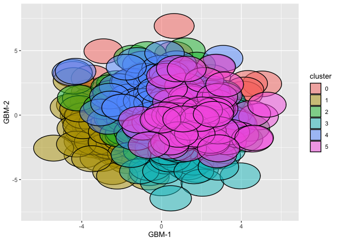
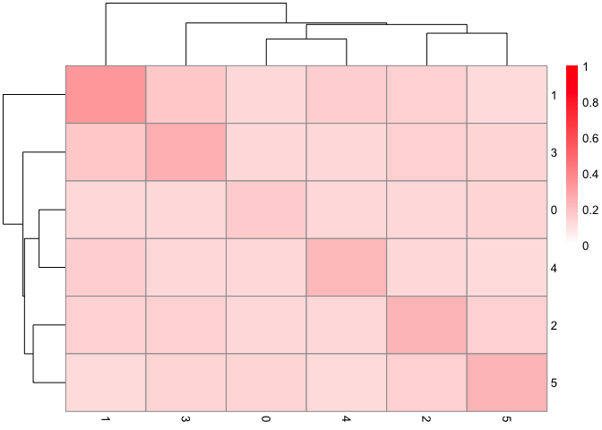
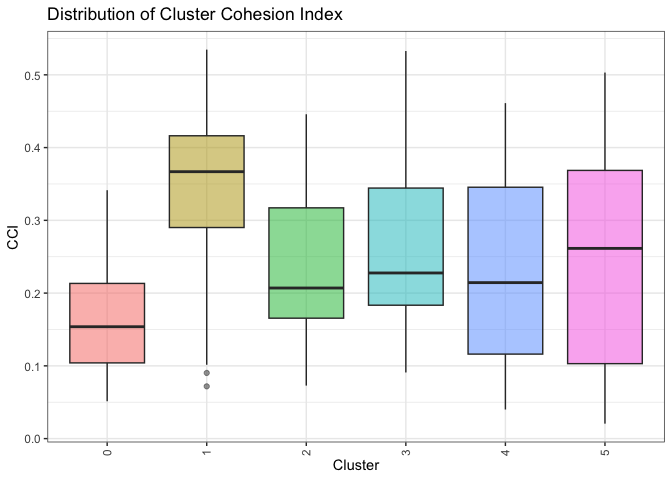

Model-based Dimensionality Reduction for Single-cell RNA-seq with
Generalized Bilinear Models
================
R package version 1.2.0

## Installation

From the R console, `devtools::install_github("phillipnicol/scGBM")`.

## Demo

We demonstrate scGBM by applying it to a random noise (i.e., a dataset
with no latent variaiblity).

``` r
library(scGBM)
set.seed(1126490984)
```

We begin by generating the count matrix such that each entry is
(independently) Poisson with rate 1:

``` r
I <- 500
J <- 500
Y <- matrix(rpois(I*J,lambda=1),nrow=I,ncol=J)
colnames(Y) <- 1:J; rownames(Y) <- 1:I
```

Run scGBM with $M = 10$ latent factors

``` r
out <- gbm.sc(Y,M=10)
```

    ## Iteration:  1 . Objective= -246881.1 
    ## Iteration:  2 . Objective= -241241.3 
    ## Iteration:  3 . Objective= -240373.3 
    ## Iteration:  4 . Objective= -240315.5 
    ## Iteration:  6 . Objective= -240315.5 
    ## Iteration:  7 . Objective= -240300.8 
    ## Iteration:  8 . Objective= -240287.2 
    ## Iteration:  9 . Objective= -240281.6 
    ## Iteration:  10 . Objective= -240280.9 
    ## Iteration:  11 . Objective= -240279.4 
    ## Iteration:  12 . Objective= -240276.1 
    ## Iteration:  13 . Objective= -240274.3 
    ## Iteration:  15 . Objective= -240274.3 
    ## Iteration:  16 . Objective= -240272.8 
    ## Iteration:  17 . Objective= -240270.5 
    ## Iteration:  18 . Objective= -240268.7 
    ## Iteration:  19 . Objective= -240268.3 
    ## Iteration:  21 . Objective= -240268.3 
    ## Iteration:  22 . Objective= -240268.2 
    ## Iteration:  23 . Objective= -240268 
    ## Iteration:  24 . Objective= -240267.9 
    ## Iteration:  25 . Objective= -240267.8 
    ## Iteration:  26 . Objective= -240267.6 
    ## Iteration:  27 . Objective= -240267.2 
    ## Iteration:  28 . Objective= -240266.7 
    ## Iteration:  29 . Objective= -240266.4

    ## For users of newer versions (1.0.1+): the `scores` matrix now contains factor scores, the `V` matrix is UNSCALED scores.

To use the projection method (faster version based on subsampling), use

``` r
##Specify subsample size and number of cores
out.proj <- gbm.sc(Y,M=10,subset=100,ncores=8) 
```

Cluster the cell scores using Seurat

``` r
library(Seurat)
Sco <- CreateSeuratObject(counts=Y)
colnames(out$scores) <- 1:10
Sco[["gbm"]] <- CreateDimReducObject(embeddings=out$scores,key="GBM_")
Sco <- FindNeighbors(Sco,reduction = "gbm")
Sco <- FindClusters(Sco)
```

Plot the scores and color by the assigned clustering:

``` r
plot_gbm(out, cluster=Sco$seurat_clusters)
```

<!-- -->

Quantify the uncertainty in the low dimensional embedding:

``` r
out <- get.se(out)

## Standard errors of scores and loadings are now in the list
head(out$se_scores) 
```

    ##              1         2         4         3         5         7         6
    ## [1,] 0.9818454 0.9648486 0.9970515 0.9836591 0.9998857 1.0037412 0.9921433
    ## [2,] 0.9857107 0.9595188 1.0203683 0.9940216 0.9986431 0.9977712 0.9878560
    ## [3,] 0.9705299 0.9598379 0.9297896 0.9670845 0.9517267 0.9645998 0.9587170
    ## [4,] 0.9664405 0.9667122 0.9454582 0.9524491 0.9495731 0.9468009 0.9523415
    ## [5,] 1.0077513 1.0151847 0.9930146 0.9864628 0.9917487 1.0031665 1.0012457
    ## [6,] 1.0525799 1.0396983 1.0658745 1.0441789 1.0529122 1.0437008 1.0453202
    ##              8         9        10
    ## [1,] 0.9987585 1.0016256 0.9811790
    ## [2,] 0.9952865 1.0033278 0.9729804
    ## [3,] 0.9672515 0.9692597 0.9674929
    ## [4,] 0.9579136 0.9467246 0.9495301
    ## [5,] 1.0000469 1.0145981 0.9948347
    ## [6,] 1.0503104 1.0489968 1.0302706

You can visualize the uncertainty with ellipses around the points

``` r
plot_gbm(out, cluster=Sco$seurat_clusters, se=TRUE)
```

<!-- -->

Now we evaluate cluster stability using the cluster cohesion index.
First we need to define a function that takes as input a set of
simulated scores $\tilde{V}$ and returns a new clustering:

``` r
cluster_fn <- function(V,Y) {
  Sco <- CreateSeuratObject(Y)
  colnames(V) <- 1:ncol(V)
  Sco[["gbm"]] <- CreateDimReducObject(embeddings=V,key="GBM_")
  Sco <- FindNeighbors(Sco,reduction = "gbm")
  Sco <- FindClusters(Sco)
  as.vector(Sco$seurat_clusters)
}
```

Now we can run the CCI function. Here we set `reps=10` to make it fast
but `reps=100` (or higher) is recommended on real analyses.

``` r
cci <- CCI(out,cluster.orig=Sco$seurat_clusters, reps=25, cluster.fn = cluster_fn, Y=Y)
```

``` r
pheatmap::pheatmap(cci$H.table,legend=TRUE, color=colorRampPalette(c("white","red"))(100),
        breaks=seq(0,1,by=0.01),
        rownames=TRUE,
        colnames=TRUE)
```

<!-- -->

``` r
#Just the diagonal
cci$cci_diagonal
```

<!-- -->

The heatmap shows there is significant overlap between the clusters.
This is expected because the data was simulated to have no latent
variability.

## Reference

If you use `scGBM` in your work, please cite:

Nicol, P.B. and Miller, J.W. (2023). Model-based dimensionality
reduction for single-cell RNA-seq using generalized bilinear models.
bioRxiv.
