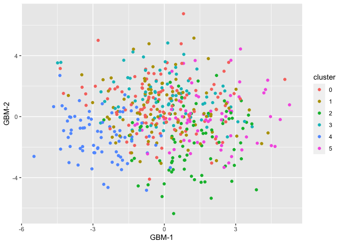
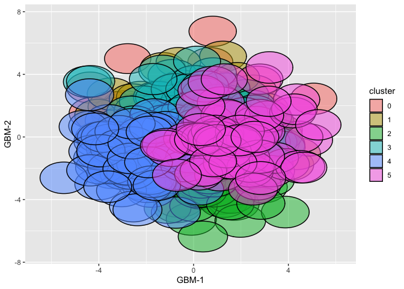

Model-based Dimensionality Reduction for Single-cell RNA-seq with
Generalized Bilinear Models
================
R package version 0.1.0

## Installation

From the R console, `devtools::install_github("phillipnicol/scGBM")`.

## Demo

``` r
library(scGBM)
set.seed(1126490984)
```

Generate a count matrix that is random Poisson noise:

``` r
I <- 500
J <- 500
Y <- matrix(rpois(I*J,lambda=1),nrow=I,ncol=J)
colnames(Y) <- 1:J; rownames(Y) <- 1:I
```

Run scGBM with $M = 10$ latent factors

``` r
out <- gbm.sc(Y,M=10)
```

    ## Iteration:  1 . Objective= -240304.2 
    ## Iteration:  2 . Objective= -240294.5 
    ## Iteration:  3 . Objective= -240287 
    ## Iteration:  4 . Objective= -240281.6 
    ## Iteration:  5 . Objective= -240277.9 
    ## Iteration:  6 . Objective= -240275.1 
    ## Iteration:  7 . Objective= -240273 
    ## Iteration:  8 . Objective= -240271.2 
    ## Iteration:  9 . Objective= -240269.9 
    ## Iteration:  10 . Objective= -240269.1 
    ## Iteration:  11 . Objective= -240268.9 
    ## Iteration:  13 . Objective= -240268.9 
    ## Iteration:  14 . Objective= -240268.6 
    ## Iteration:  15 . Objective= -240268 
    ## Iteration:  16 . Objective= -240267.4 
    ## Iteration:  17 . Objective= -240267

To use the projection method (faster version based on subsampling), use

``` r
##Specify subsample size and number of cores
out.proj <- gbm.sc(Y,M=10,subset=100,ncores=8) 
```

Cluster the cell scores using Seurat

``` r
library(Seurat)
Sco <- CreateSeuratObject(counts=Y)
colnames(out$V) <- 1:10
Sco[["gbm"]] <- CreateDimReducObject(embeddings=out$V,key="GBM_")
Sco <- FindNeighbors(Sco,reduction = "gbm")
Sco <- FindClusters(Sco)
```

Plot the scores and color by the assigned clustering:

``` r
plot_gbm(out, cluster=Sco$seurat_clusters)
```

<!-- -->

Quantify the uncertainty in the low dimensional embedding:

``` r
out <- get.se(out)

## Standard errors of V and U are now in the list
head(out$se_V) 
```

    ##              1         2         3         4         5         6         7
    ## [1,] 0.9848234 0.9689303 0.9880989 0.9986832 1.0013979 0.9967517 1.0013323
    ## [2,] 0.9852984 0.9585690 0.9950856 1.0178229 0.9912398 0.9935041 0.9989354
    ## [3,] 0.9707660 0.9574002 0.9675917 0.9309583 0.9522230 0.9566709 0.9655341
    ## [4,] 0.9670084 0.9667028 0.9483449 0.9458617 0.9434126 0.9551795 0.9546598
    ## [5,] 1.0068426 1.0176532 0.9865573 0.9884981 1.0084605 0.9853104 0.9968485
    ## [6,] 1.0560701 1.0437247 1.0455669 1.0654722 1.0435426 1.0575476 1.0455543
    ##              8         9        10
    ## [1,] 1.0005233 0.9963515 0.9813010
    ## [2,] 0.9927224 1.0027732 0.9775374
    ## [3,] 0.9640886 0.9741119 0.9676006
    ## [4,] 0.9548456 0.9476875 0.9471757
    ## [5,] 0.9990949 1.0173108 0.9915947
    ## [6,] 1.0514588 1.0454769 1.0315178

You can visualize the uncertainty with ellipses around the points

``` r
plot_gbm(out, cluster=Sco$seurat_clusters, se=TRUE)
```

<!-- -->

Now we evaluate cluster stability using the cluster confidence index.
First we need to define a function that takes as input a set of
simulated scores $\tilde{V}$ and returns a new clustering:

``` r
cluster_fn <- function(V,Y) {
  Sco <- CreateSeuratObject(Y)
  colnames(V) <- 1:ncol(V)
  Sco[["gbm"]] <- CreateDimReducObject(embeddings=V,key="GBM_")
  Sco <- FindNeighbors(Sco,reduction = "gbm")
  Sco <- FindClusters(Sco)
  as.vector(Sco$seurat_clusters)
}
```

Now we can run the CCI function. Here we set `reps=10` to make it fast
but `reps=100` (or higher) is recommended on real analyses.

``` r
cci <- CCI(out,cluster.orig=Sco$seurat_clusters, reps=10, cluster.fn = cluster_fn, Y=Y)
```

``` r
pheatmap::pheatmap(cci$H.table,legend=TRUE, color=colorRampPalette(c("white","red"))(100),
        breaks=seq(0,1,by=0.01),
        rownames=TRUE,
        colnames=TRUE)
```

<!-- -->

``` r
#Just the diagonal
cci$cci.plot
```

<!-- -->

The heatmap shows there is significant overlap between the clusters.
This makes sense because the data was simulated to have no latent
variability.
